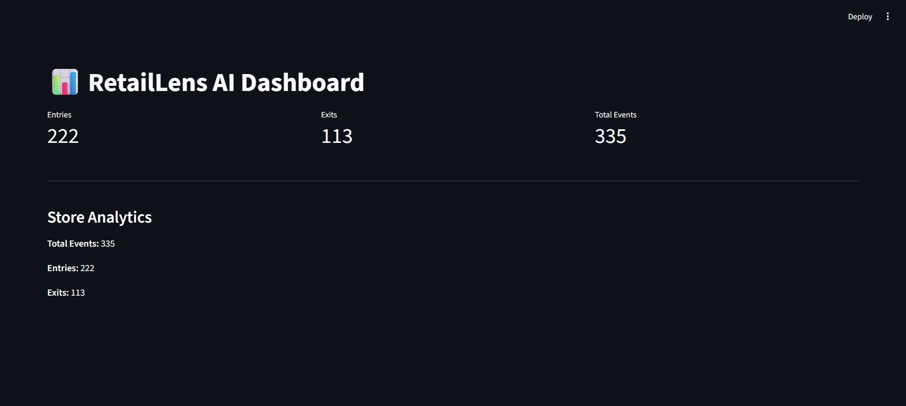
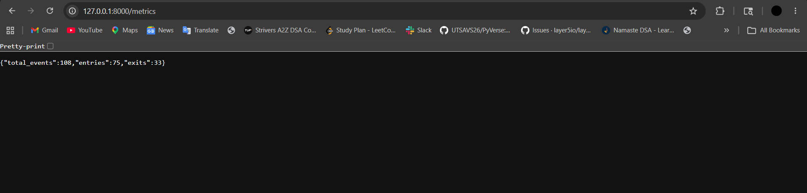

# 🏬 RetailLens – AI Powered Store Intelligence

## 📖 Overview

RetailLens is a real-time retail analytics platform designed to transform customer movement data into actionable business insights.

The system simulates CCTV-based visitor tracking, processes customer events through a FastAPI backend, and visualizes live store performance using an interactive Streamlit dashboard.

It demonstrates how retailers can monitor customer flow, analyze visitor behavior, and generate operational intelligence through an event-driven architecture.

---

## ✨ Features

- 🎯 Customer Entry & Exit Tracking
- ⚡ Real-Time Event Ingestion API
- 📊 Live Analytics Dashboard
- 📈 Visitor Traffic Metrics
- 🔄 Event Simulator for Continuous Data Generation
- 🧮 Conversion & Funnel Analytics
- 🚨 Anomaly Detection Support
- 🐳 Dockerized Deployment
- 🌐 Cloud Deployment on Render

---

## 📸 Dashboard Preview

### Live Analytics Dashboard



### Metrics API Output



---

## 🎥 Demo Video

Watch the complete working demonstration here:

https://drive.google.com/drive/folders/1L_4cy9j8hAfzLq0vpgrlgaWW1HZAa_xU?usp=drive_link

---

## ⚙️ Running the Backend

Start the FastAPI server:

```bash
uvicorn app.main:app --reload
```

Backend URL:

```text
http://127.0.0.1:8000
```

Swagger Documentation:

```text
http://127.0.0.1:8000/docs
```

---

## 📡 Generate Sample Events

Run the simulator to continuously generate customer movement events:

```bash
python simulator.py
```

---

## 📊 Launch Live Dashboard

Start the Streamlit dashboard:

```bash
streamlit run streamlit_dashboard.py
```

Dashboard URL:

```text
http://localhost:8501
```

---

## 🏗️ Project Structure

```text
store-intelligence/
│
├── app/
│   ├── main.py
│   ├── ingestion.py
│   ├── metrics.py
│   ├── funnel.py
│   ├── anomalies.py
│   ├── health.py
│   └── models.py
│
├── pipeline/
│
├── tests/
│
├── docs/
│
├── simulator.py
├── streamlit_dashboard.py
├── docker-compose.yml
├── requirements.txt
├── dashboard.png
├── metrics.png
└── README.md
```

---

## 🧪 Sample Event

Use the following payload to test the API:

```json
{
  "store_id": "STORE_001",
  "camera_id": "CAM_1",
  "visitor_id": "V101",
  "event_type": "ENTRY"
}
```

---

## 🐳 Docker Setup

### Build & Run

```bash
docker compose up --build
```

### Access Swagger

```text
http://localhost:8000/docs
```

### Stop Containers

```bash
Ctrl + C
```

---

## 📌 Technology Stack

- Python
- FastAPI
- Streamlit
- Docker
- YOLOv8
- REST APIs
- Render

---

## 🚀 Future Enhancements

- Store Heatmap Visualization
- Multi-Store Analytics Dashboard
- Dwell-Time Tracking
- Real-Time CCTV Stream Integration
- Advanced Anomaly Detection
- Predictive Retail Insights

---

## 👩‍💻 Author

**Manpreet Saini**

Built for the Purple Merit Store Intelligence Challenge.
